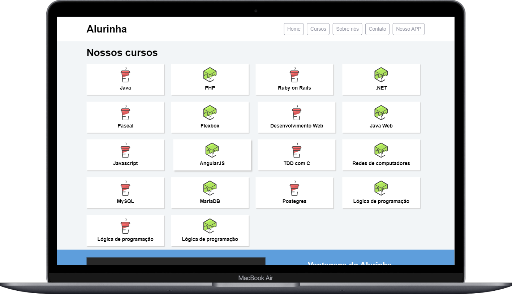
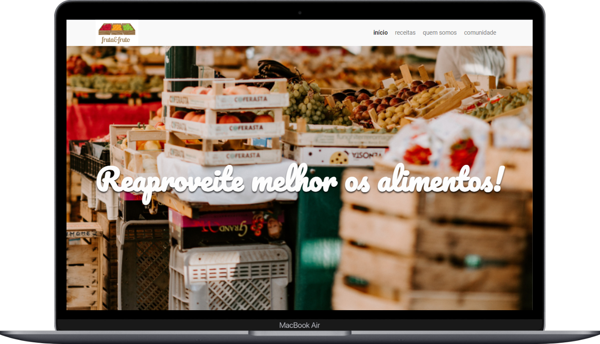
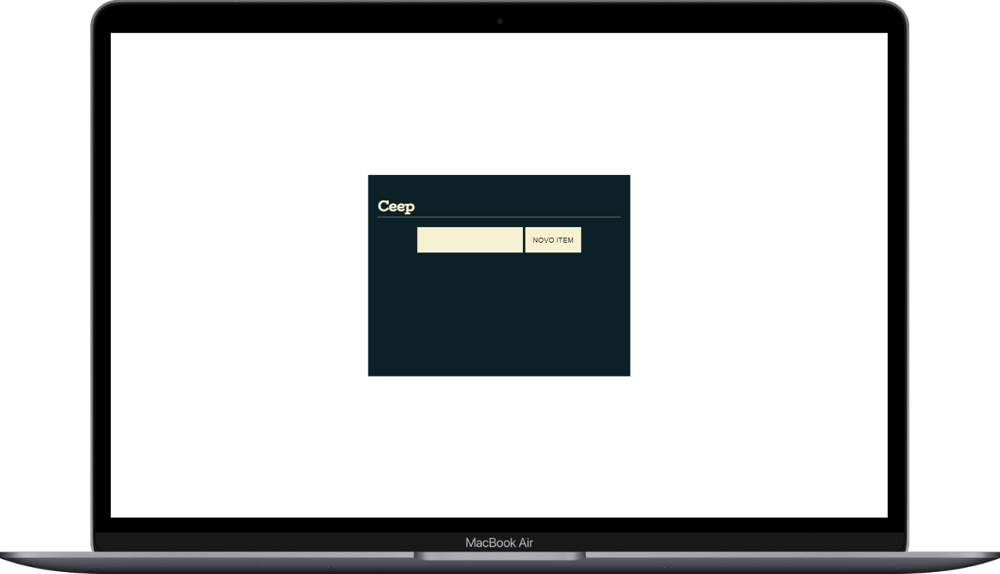
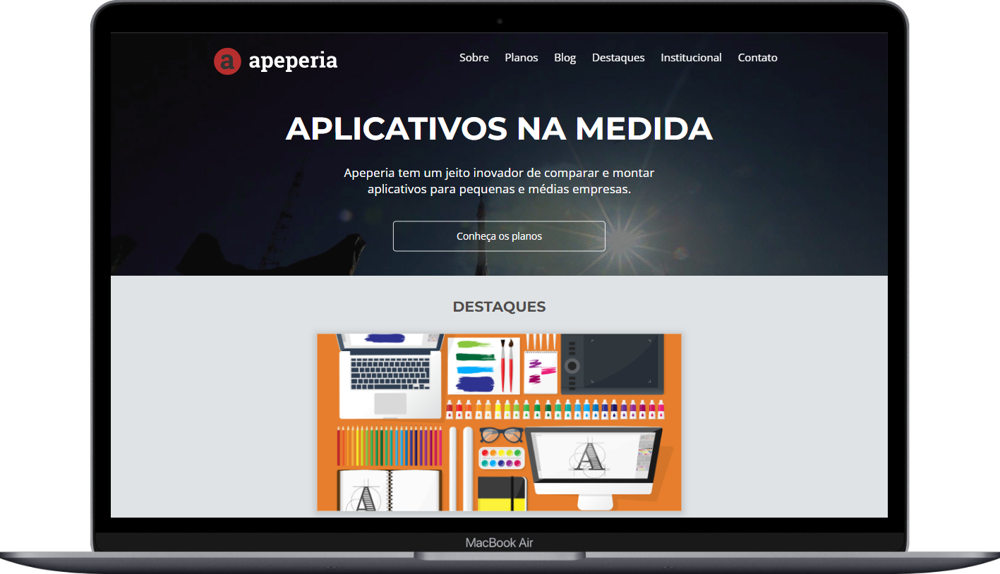
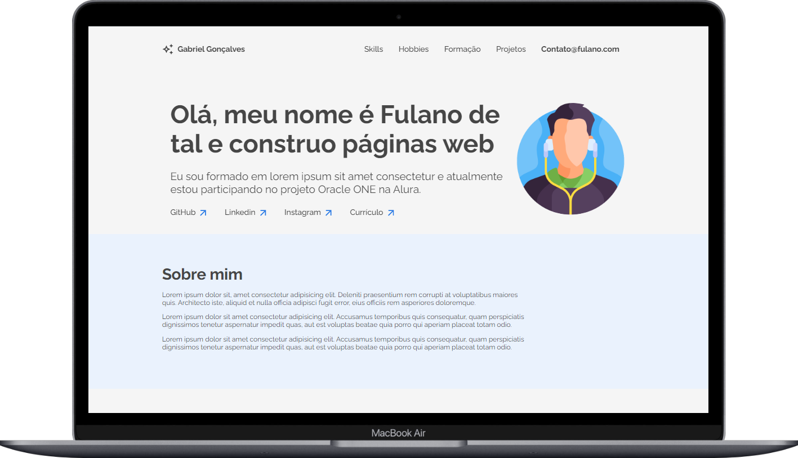
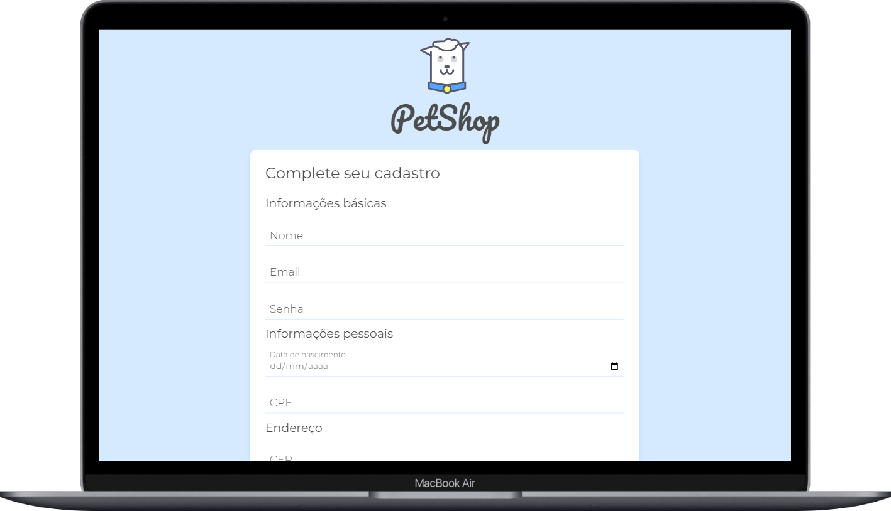

 <h1 align="center">
  Projetos Alura Front End 
</h1>

  <a href="#-licença">Licença</a>&nbsp;&nbsp;&nbsp;|&nbsp;&nbsp;&nbsp;
  <a href="#-contato">Contato</a>

 

  <h2 align="center" >Index Projetos 💻</h2>

  <a href="#alurinha-🅰%EF%B8%8F">Alurinha 🅰️</a> &nbsp;&nbsp;&nbsp;|&nbsp;&nbsp;&nbsp;
  <a href="#fruta--fruto-">Fruta & Fruto 🍎</a> &nbsp;&nbsp;&nbsp;|&nbsp;&nbsp;&nbsp;
  <a href="#ceep-%EF%B8%8F⃣">Ceep #️⃣</a> &nbsp;&nbsp;&nbsp;|&nbsp;&nbsp;&nbsp;
  <a href="#apeperia-">Apeperia 🤖</a> &nbsp;&nbsp;&nbsp;|&nbsp;&nbsp;&nbsp;
  <a href="#portfólio-%EF%B8%8F">Portfólio 🖥️</a> &nbsp;&nbsp;&nbsp;|&nbsp;&nbsp;&nbsp;
  <a href="#petshop-form-">PetShop Form 🐶</a> 

---

 
 

# Alurinha 🅰️

Aqui você pode conferir o layout.  

[👉 Link para visualizar a pagina inteira](https://gabrielfleckl.github.io/projetos-trilha-front-end-alura/FlexBox/index.html)

### Versão Web 🖥️

 
   

 

## 🚀 Tecnologias

Esse projeto foi desenvolvido com as seguintes tecnologias:

 
 

---

 

# Fruta & Fruto 🍎

Aqui você pode conferir o layout.  

[👉 Link para visualizar a pagina inteira](https://gabrielfleckl.github.io/projetos-trilha-front-end-alura/Projeto-fruta-fruto/index.html)

### Versão Web 🖥️

 
   
  
 

## 🚀 Tecnologias

Esse projeto foi desenvolvido com as seguintes tecnologias:

 
 

---

 

# Ceep #️⃣

Aqui você pode conferir o layout.  

[👉 Link para visualizar a pagina inteira](https://gabrielfleckl.github.io/projetos-trilha-front-end-alura/projeto-DOM/projeto_final/index.html)

### Versão Web 🖥️

 
   
  
 

## 🚀 Tecnologias

Esse projeto foi desenvolvido com as seguintes tecnologias:

 
 

---

 

# Apeperia 🤖

Aqui você pode conferir o layout.  

[👉 Link para visualizar a pagina inteira](https://gabrielfleckl.github.io/projetos-trilha-front-end-alura/Projeto-Apeperia/index.html)

### Versão Web 🖥️

 
   
  
 

## 🚀 Tecnologias

Esse projeto foi desenvolvido com as seguintes tecnologias:

 
 

---

 

# Portfólio 🖥️

Aqui você pode conferir o layout.  

[👉 Link para visualizar a pagina inteira](https://gabrielfleckl.github.io/projetos-trilha-front-end-alura/Projeto-portfolio-alura/index.html)

### Versão Web 🖥️

 
   
  
 

## 🚀 Tecnologias

Esse projeto foi desenvolvido com as seguintes tecnologias:

 
 
 

---

 

# PetShop Form 🐶

Aqui você pode conferir o layout.  

[👉 Link para visualizar a pagina inteira](https://gabrielfleckl.github.io/projetos-trilha-front-end-alura/validacao-doguito-main/cadastro.html)

### Versão Web 🖥️

 
   
  
 

## 🚀 Tecnologias

Esse projeto foi desenvolvido com as seguintes tecnologias:

 
 

---
## 📝 Licença

Esse projeto está sob a licença MIT. Veja o arquivo [LICENSE](LICENSE) para mais detalhes.

## 🌐 Contato

 

---

Feito com ♥ by Gabriel Gonçalves 🖖 &nbsp;&nbsp;&nbsp;|&nbsp;&nbsp; <a href="#--projetos-alura-front-end-">Voltar para o Inicio ⬆️ </a>
